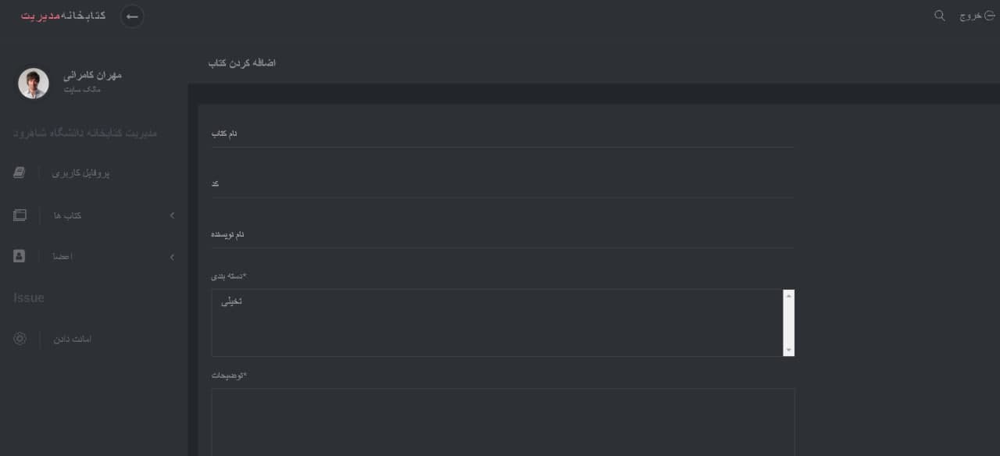

# Management Library Project

**this is a simple project**

## Need to be done
- [ ] use celery for send email
- [ ] send email for delay return book
- [ ] use postgresql database
- [X] ~~Renew book~~
- [X] ~~Return book~~
- [X] ~~Issue book~~
- [X] ~~sign up and login user~~
- [X] ~~list issue and publish book~~

# Screen Shots





# Install required packages and RUN docker container:
```
pip3 install -r requirements.txt
python manage.py makemigrations
python manage.py migrate
python manage.py runserver
```


## enjoing
;)
